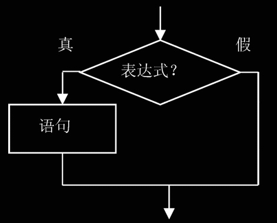
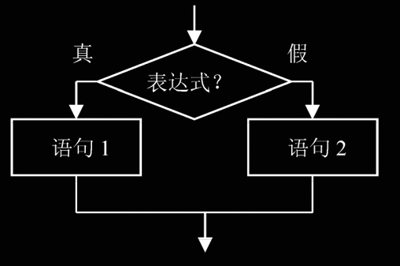
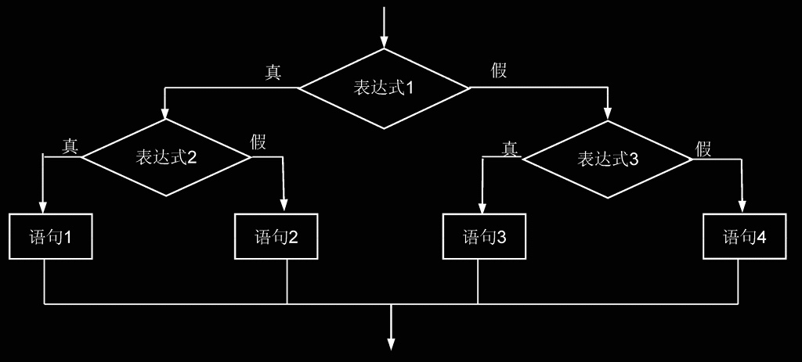
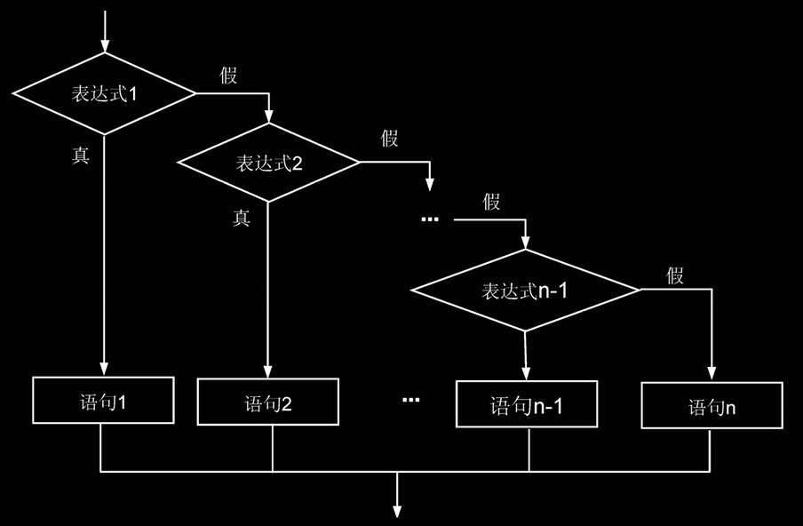
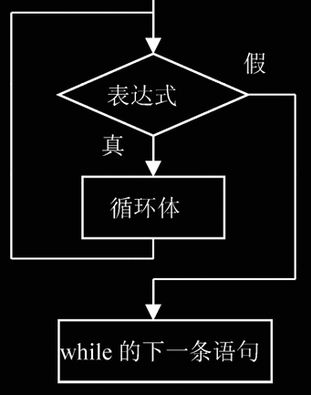
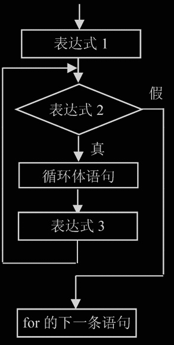
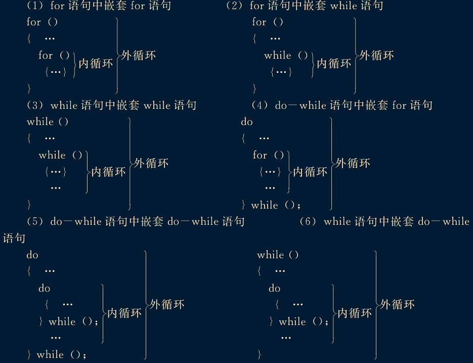

# 2020.04.02补充
-----------------------------------------------
**既然程序的基本控制结构学完了，那我就整理整理知识点吧**

>先回忆：
>在高级程序语言中，存在着一种用来判断“**是**”或“**否**”等条件的数值  
>它们分别被称为**真值(ture)**和**假值(false)**  
>真值是**除了0以外的数值**，假值就是**0**  
>它们也可以用`ture`或`false`来代替  

## 分支结构

我暂且先将分支结构列为四种，分别是：
* if
* if-else
* switch()
* goto  --> 这个有争议，暂时先忽略

### if
这是一个最简单的分支结构语句了，我们用伪代码描述一下：
```c
if ( [当条件符合时] ) {
    ......
    （做条件符合时该做的事）
}
......
（继续执行程序）
```  
流程图如下：
> 

if()括号中的东西是一个**判断表达式**，它需要返回一个ture或false的值（例如0或1）来决定是否执行if结构内的代码，如果判断表达式的值为ture，则执行if内的代码，否则就会跳过if内的代码，继续执行之后的代码

>把你想在结构体中所做的事情用花括号`{}`括起来，是个好习惯  
>不过在结构后面只有一条语句的时候，是不需要花括号的

### if-else
这个结构可以为程序的执行多一种选择：
```c
if ( [当条件符合时] ) {
    ......
    （做条件符合时该做的事）
}
else {
    ......
    (做条件不符合时该做的事)
}
......
（继续执行程序）
```
流程图如下:
> 

它的原理跟if是一样的，只不过，程序看到它，会在**不符合if()括号中的条件**时去试试else中的条件符不符合  
也就是多了一条可以选择的路  
如果else()括号里的条件也不符合，程序就会跳过这个if-else结构体，继续执行之后的代码   
如果这个结构中有一个条件符合，程序就会对应的执行那个结构内的代码，然后继续执行结构之后的代码

### 多重／嵌套if-else

```c
if ( [表达式1] ) {
    if ( [表达式2] ) {  //表达式1为真时执行
    ......（语句1）
    }
    
    else {
    ......（语句2）
    }

}

else {  //表达式1为假时执行
    if ( [表达式3] ) {
    ......（语句3）
    }
    
    else {
    ......（语句4）
    }
}
```

这里用流程图表示会更清楚：
> 

> p.s if-else的配对
> 
> 多重if-else是一种级联结构，即每一层的else-if都具有关联性
> 
```c
//if-else结构

if ( [当条件A符合时] ) {
    ......
    （做条件A符合时该做的事）
}

else if ( [当条件B符合时] ) {
    ......
    (做条件B符合时该做的事)
}

else if ( [当条件C符合时] ) {
    ......
    (做条件C符合时该做的事)
}

......（多个else-if）

else {
    ......
    (做其他条件都不符合时该做的事)
}
```
> 实际上，多重if-else级联只是一种if-else结构的变式  
> 把这种级联拆开就是下面这样的嵌套关系了  
> 当然，实际使用中if-else级联会更简洁明了  
```c
//多重if-else级联的变式
if ( [当条件A符合时] ) {
    ......（做条件A符合时该做的事）
    ｝
    
else ｛
    if ( [当条件B符合时] ) {
        ......（做条件B符合时该做的事）
    }
        
    else {
        if ( [当条件C符合时] ) {
        ......（做条件C符合时该做的事）
        }

             ......(省略n层嵌套)

        else {
            ......(做其他条件都不符合时该做的事)
        }
    ｝
｝
```
> 这里附上if-else级联的流程图：  

> 

### switch() --更具针对性的选择
```c
switch( [某个标签（可以是表达式的值）] ) {
    case [标签1]:    //每个对应标签后面是冒号！
    ......(执行语句1);
    break;          //执行完代码后跳出switch结构

    case [标签2]:    //每个对应标签后面是冒号！
    ......(执行语句2);
    break;

    case [标签3]:    //每个对应标签后面是冒号！
    ......(执行语句3);
    break;
    ......（省略n层标签） 

    default :       //当没有标签能够匹配时默认执行的语句
    ......(执行默认语句);

    /* 最后一个标签通常不需要加上break语句
       因为已经到switch结构的末尾了，程序会自己跳出结构 */
}
```

流程图如下：
> 

switch()中的括号里和每一个case标签都必须包含一个**整数值**__（包括char类型）__  
且用于case标签的数值必须为常量或**完全**由常量组成的表达式  
如果表达式的值可以跟某个case的标签配对，则程序转向该标签执行之后的语句  
如果没有任何一个标签可以跟表达式配对，则执行`default`标签的内容  
**若语句结束后没有break语句跳出，则程序流将继续往下执行**  

还可以用case的特点设置多重确认：
```c
    case [标签1]:
    case [标签2]:   //在输入两种不同数值时执行同一语句
    ......(执行语句1);
    break;
```

## 循环结构
一共有三种：
* for()
* while()
* do while()

其中，for与while本质上是等价的，怎么解释呢？

我们先想一下完成一个循环所需要的三个行为：

* 初始化表达式：用来作为一个循环的初始次数，一般是0，注意这个表达式不要放到循环体里面！（不然就是死循环了）

* 测试表达式：用来判断这个循环是否继续执行的表达式，也就是判断循环执行的条件

* 更新表达式：在循环继续执行的时候，用来更新循环执行的次数，这与是否执行下一次循环密切相关

然后我们把这三个条件分别放到for循环与while循环里面比较一下它们的区别：
### while循环
```c
[初始化表达式];
while ( [测试表达式] ) {
...... （此处省略n行代码）
[更新表达式];
}
```
while()流程图：
> 


### for循环
```c
for ( [初始化表达式]; [循环表达式]; [更新表达式] ) {
...... （此处省略n行代码） 
}
```
for()流程图
> 

可以看到，这俩结构的区别并不大，但是for循环有一个优点，那就是它可以把三个行为写在一起，使得结构上比较紧凑，可以防止漏写或错写其中的表达式，例如，while循环中比较容易犯的一个错误就是把初始化表达式放到循环体里面：
```c
int i;
......
while (i < 10) {
i = 0;		//这个表达式放这里真的好吗?
               ......（此处省略n行代码）
i++;		//更新表达式
}
```
如果你把int i =0这样的初始化表达式放到了循环体里面，那么每次执行循环的时候，判断表达式的值也就永远都在0这个地方徘徊了
如果能像for循环那样放在一起就好了：
```c
int i;
for (i = 0; i < 10; i++) { 		//三个表达式放在一起
...... （此处省略n行代码）
}
```

这样做一目了然，减少的出错的可能性。实际上，通过对for 循环的改造，我们也可以得到与while循环等效的结构：
```c
int i = 0;		//初始化
for (; i <10; ) {		//判断
......（此处省略n行代码）
i++;		//更新
}
```
没错！正常运行情况下，for循环括号中的三个表达式，除了第二项（测试表达式）不能省略之外，其他的两个表达式都是可选的，只需要把它们放在正确的位置上就可以了，但是要记住，**不管有没有表达式，两个分号是绝对不能省略的！**

比如说，我想写一个死循环，可以这么写：
```c
for ( ; ; ) {	//注意一下这里的分号，并没有省略
     printf("不要停下来啊！\n");
}		
//p.s. 若省略了第二个判断表达式，编译器默认为true
```
**for循环中如果你漏掉了分号，编译器就会报错，指出这是一个语法错误**

while()循环可以做到同样的事情：
```c
while (1) {   //这里只要是非0数值都可以
     printf("不要停下来啊！\n");
}
```
只要循环体内的语句不包含能够跳出循环的语句（比如break），那么这个循环就会一直执行下去，就会一直执行printf语句

**实际上for循环是一个灵活性很高的循环结构，如果你愿意，甚至可以用逗号操作符把一个循环的语句全部写到for()的括号里面**

在for循环括号中的第三个表达式，实际上可以是任意合法的表达式：  
举个栗子（这是我们上次写的数字排序循环的其中一种方法）：
```c
k1 = 1;  k2 = 10000;  temp = 0;
while (t3 != 0) {
	temp = t3 % 10;
	p1 += (temp * k1);
	p2 += (temp * k2);
	t3 /= 10;  k1 *= 10;  k2 /= 10;
}
```

用上for循环和逗号运算符来连接表达式，就可以写成这样了：  
（注意分号的位置）
```c
for (temp = 0,k1 = 1, k2 = 10000; t3 != 0; k1 *= 10, k2 /= 10, temp = t3 % 10;) {
	p1 += (temp * k1);
	p2 += (temp * k2);
	t3 /= 10;
	}
```

通过在第三个表达式的位置添加语句，可以适当的改造循环的主体结构，使得循环体更容易能理解，与while相比确实紧凑了不少!

### do-while 结构
**作为出口循环，它可以先执行操作，后判断，格式如下：**
```c
[初始化表达式];
do {
.....
.....（此处省略n行代码）
[更新表达式];
} while ( [测试表达式] );
```
do-while流程图：
> 

1.这里同样要注意，初始化表达式不能写在do-while结构内！  
2.此外，注意这个结果的书写格式，结尾的while后面要跟上分号  
3.如果只有一条语句，花括号也是可以不用加的  
4.使用do-while循环有时候可以减少一些重复的代码，例如：
（实验五第六题(1)，重复验证答案）

```c
do {
	printf("--Wrong! Please try again! \n"
		   "%d * %d = ", *a, *b);
	while (getchar() != '\n') 	//刷新缓冲区
		continue;
	} while (0 == scanf("%d", &w_res) || w_res != (*a) * (*b));
```
如果用while循环就要这么写：
```c
printf("--Wrong! Please try again! \n"      "%d * %d = ", *a, *b);  	//多加的部分
	while (0 == scanf("%d", &w_res) || w_res != (*a) * (*b)) {
	printf("--Wrong! Please try again! \n"
		   "%d * %d = ", *a, *b);
	while (getchar() != '\n') 	//刷新缓冲区
		continue;
	}
```
与do-while相比，我们需要多加上一句printf输出才能达到一样的效果。   
5.由于do-while 是先执行，后判断，所以循环体至少会被执行一次，此时要注意你的循环体内有哪些东西是不需要至少被执行一次的，如果有，就应该安排好它的位置，否则就换用while或者for循环
比如说下面这个验证用户密码的程序（伪代码描述）：
```c
do {
提示用户输入密码;
验证用户输入密码;
.....
} while ( 用户输入的密码不正确 );
```
上面这样写没有问题，但是如果你想在while之前加上一些其他功能：
```c
do {
.....
提示用户是否继续输入密码;
[其他功能];
.....
} while ( 回答Yes );
```
这样写的话，用户输入之后，循环还会被执行一遍来判断用户输入的是什么信息，然后__[其他功能]__还会再执行一遍，因为这个时候测试条件已经晚了，这里一定要避免这样的用法。

那么在实际使用的时候要如何确定使用哪一种循环呢？大家已经学过了，**for循环更适合已知初始化次数和更新变量的循环结构，而while循环更适合”不确定性“循环，do-while适合那些至少被执行一次的循环结构。**

实际上针对入口循环而言，for和while两者的效果都是一样的，可以看个人喜好，最好看程序的要求来选择。一般来说，入口循环与出口循环相比，由于表达式和条件放在头部，可读性较高，而且大部分场合下，入口循环使用的会比较多（即先判断，后执行）。具体如何操作，还是要看各位自己如何设计这个程序了。  
编程中的一个原则就是代码保持简洁易懂，如果这部分的功能使用某种写法过于复杂且难以维护，那就换用另外一种写法。同理，如果你认为这种类型的循环结构会增加代码量，那就换一种循环结构使用（比如上文所述的使用do-while和while的区别）。

### 多重/嵌套循环
> 

**一般来说，两层嵌套使用的会比较广**  

**这里有一个程序来给大家实践一下，如何用printf()来创造计算机艺术**  
**欣赏的同时别忘了推导一下里面的代码是如何实现这样的效果的**  
**有助于理解嵌套循环的内容哦**  

> 嵌套循环打印示例  
> https://github.com/SzLeaves/C-Practise/blob/master/C6/loop-print_letter.c

### break和continue
控制结构的中断和跳出  
这两种语句仅针对循环结构有效  
**其中break语句仅针对switch和循环结构有效！**

在设计复杂的程序流结构时，可以适当运用这两种语句在分支条件中执行不同的操作

> 关于复杂程序流的设计，在学习函数之后再作说明

## 循环结构中的作用域
我们先看一个循环结构的代码：
```c
//这个程序能运行吗？
#include<stdio.h>
int main(void) {
	int a = 1;

	while (a <= 10) {
		int temp = a;
		printf("第%d次循环\n", temp);
		temp++;
		a = temp;
	}

	printf("\ntemp的值：%d", temp);

	return 0;
}
```
还可以用for()循环做同样的事情：
```c
//这个程序能运行吗？
#include<stdio.h>
int main(void) {
	for (int temp = 1; temp <= 10; temp++)
		printf("第%d次循环\n", temp);

	printf("\ntemp的值：%d", temp);

	return 0;
}
```

我们尝试编译一下，结果却是这样的：  


注意报错信息，编译器提示我们，temp是一个**没有被声明**的变量！
可是我们刚刚不是已经声明过temp这个变量了吗？  
```c
for (int temp = 1; temp <= 10; temp++) //循环内部的声明
```

声明倒是声明了，只不过是在**循环内部**声明的，上面的while循环也是一样的：
```c
while (a <= 10) {
	int temp = a;   //循环内部的声明
  ......
```
这就是循环内变量的**作用域**了，在循环内部声明的变量，只在该循环内有效  
在循环外是无效的（或者说是没有定义的）

**如果你想在一个函数内使用循环处理过的变量，请把这个变量的声明放在循环外**  
最好在函数头部就把一个程序中所需要的变量都进行声明  
> 作用域的问题，在学习函数时还会碰到，到时候我们还会再讲
